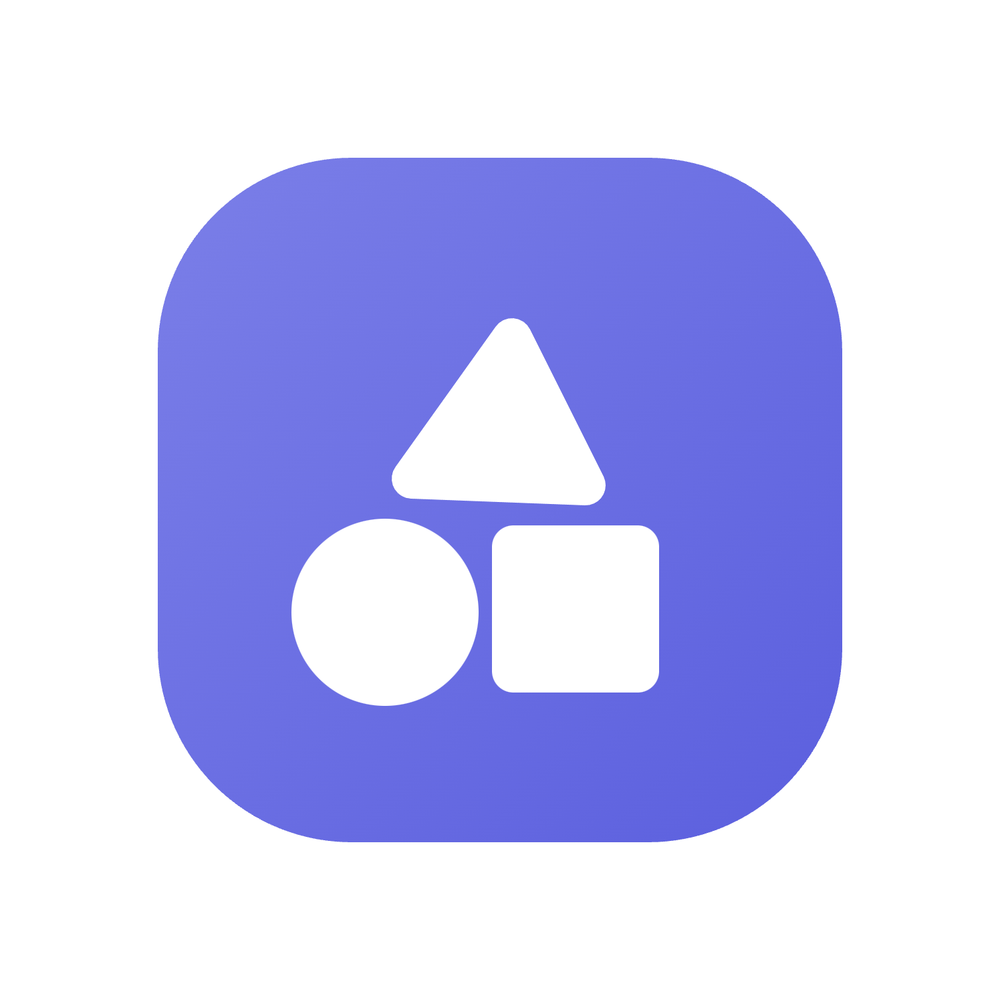

<p align="center">
  
</p>


<h1 align="center">Orion Store</h1>

<p align="center">
  <a href="https://github.com/RookieEnough/Orion-Store/stargazers"></a>
  <a href="https://github.com/RookieEnough/Orion-Store/network/members"></a>
</p>

<p align="center">
  A transparent app store built around public releases, inspectable metadata, and automation you can actually follow.
</p>

<p align="center">
  
  
  
  
  
</p>

<p align="center">
  <a href="https://www.buymeacoffee.com/rookiez" target="_blank">
    
  </a>
</p>

<br>

<p align="center">
  <a href="https://github.com/RookieEnough/Orion-Store/releases">
    
  </a>
  <a href="https://github.com/RookieEnough/Orion-Store/releases">
    
  </a>
</p>

<p align="center">
  <strong>Sources Supported</strong><br>
  <a href="https://github.com"></a>
  <a href="https://gitlab.com"></a>
  <a href="https://codeberg.org"></a>
</p>

<br>

## Overview :milky_way:

Orion Store is an Android-first store client that leans on public sources instead of hiding everything behind a private service layer. The app pulls catalog data from public JSON, resolves releases from GitHub, GitLab, and Codeberg, and keeps the delivery path understandable enough that users can see where things come from and how updates are discovered.

This repository is the client application itself. The live catalog, configuration, notices, and release metadata used by the app are maintained separately in [RookieEnough/Orion-Data](https://github.com/RookieEnough/Orion-Data), which keeps the UI and the store data cleanly separated.

> Orion is built for people who care where software comes from, not just how quickly it downloads.

At a glance:

- Public JSON catalog with inspectable configuration  
- Multi-source releases (GitHub, GitLab, Codeberg)
- Android-native install, update, and security tooling

## What makes Orion different :sparkles:

The point of Orion is not to pretend infrastructure does not exist. It is to reduce hidden infrastructure and move as much of the important behavior as possible into public, inspectable layers. Catalog entries are plain data. Release sources stay visible. Automation is handled through workflows and workers that can be reviewed, rather than through a black-box backend that users have to trust on faith.

That design carries through the app. Orion tracks installed packages, surfaces updates, manages download state, supports install flows on Android, and exposes developer-facing diagnostics for people who want to see what the store is actually doing under the hood.

## Feature atlas :rocket:

Rather than treating Orion like a download button with a search bar, the app is built as a complete release-aware client. The best way to explain it is to show the major capabilities as systems, not as a long checklist.

<p align="center">
  
</p>

<table>
  <tr>
    <td width="50%" valign="top">
      <br>
      <strong>Release intelligence</strong><br>
      Orion reads public metadata, resolves upstream releases, and keeps source provenance visible instead of burying it behind a store-owned backend.<br><br>
      <code>Public JSON</code> <code>Mirrors</code> <code>Multi-source parsing</code>
    </td>
    <td width="50%" valign="top">
      <br>
      <strong>Update center</strong><br>
      Installed packages are tracked locally, update availability is surfaced clearly, and queued downloads stay organized instead of disappearing into the background.<br><br>
      <code>Installed version checks</code> <code>Queue state</code> <code>Ready-to-install</code>
    </td>
  </tr>
  <tr>
    <td width="50%" valign="top">
      <br>
      <strong>Native install flow</strong><br>
      Orion is not limited to web-only behavior. On Android it can hand off installs natively and support faster one-tap workflows through Shizuku for users who want that path.<br><br>
      <code>Capacitor bridge</code> <code>Install handoff</code> <code>Shizuku option</code>
    </td>
    <td width="50%" valign="top">
      <br>
      <strong>Sentinel security</strong><br>
      Security tooling is built into the product rather than stapled on as an afterthought, with rapid scans, deeper file analysis, and signature-driven checks for risky packages and APKs.<br><br>
      <code>Rapid scan</code> <code>Deep scan</code> <code>Threat shards</code>
    </td>
  </tr>
  <tr>
    <td width="50%" valign="top">
      <br>
      <strong>Power tools</strong><br>
      Beyond installation, Orion includes utility workflows for APK extraction, package inspection, and system app controls for users who need more than a simple storefront.<br><br>
      <code>APK extraction</code> <code>Package detective</code> <code>System app tools</code>
    </td>
    <td width="50%" valign="top">
      <br>
      <strong>Developer visibility</strong><br>
      Orion exposes the guts of the system when needed: mirror source, cache state, GitHub API quota, source switching, and debugging surfaces that make failures easier to understand.<br><br>
      <code>Developer mode</code> <code>Diagnostics</code> <code>Metadata inspection</code>
    </td>
  </tr>
</table>

## Source support :satellite:

Orion treats multiple upstream platforms as first-class citizens, which matters because app distribution should not depend on a single forge being the only path worth supporting.

- `GitHub` is the primary release path and the center of most automation.
- `GitLab` is supported for repository metadata and raw release sourcing.
- `Codeberg` is supported as a real upstream, not a decorative fallback.

## Screenshots / UI preview :framed_picture:

The app leans into a compact, card-driven interface with a dark shell, loud accents, and clear state changes for downloads, updates, and tools. Here is the actual gallery from the project assets:

<table>
  <tr>
    <td width="20%" align="center"></td>
    <td width="20%" align="center"></td>
    <td width="20%" align="center"></td>
    <td width="20%" align="center"></td>
    <td width="20%" align="center"></td>
  </tr>
  <tr>
    <td width="20%" align="center"></td>
    <td width="20%" align="center"></td>
    <td width="20%" align="center"></td>
    <td width="20%" align="center"></td>
    <td width="20%" align="center"></td>
  </tr>
</table>

<p align="center">
  <a href="https://www.youtube.com/watch?v=dIzAipwgj6A">
    
  </a>
</p>

## How the project is structured :compass:

The application is built with React, TypeScript, Vite, Tailwind CSS, and Capacitor 7. The main app shell lives in `App.tsx`, the UI is split across `components/`, persistent client state is managed in `store/`, Android-native functionality is bridged through `plugins/AppTracker.ts`, and heavier background work is pushed into `workers/` for release aggregation, relay logic, image handling, and Sentinel support.

The repository also includes a bundled `apps.json` fallback so the client can still run with local data when needed. In normal operation, though, Orion is designed to consume public remote data and public release metadata rather than rely on a private API server.

<table>
  <tr>
    <td><strong>Area</strong></td>
    <td><strong>Responsibility</strong></td>
  </tr>
  <tr>
    <td><code>App.tsx</code></td>
    <td>Application shell, data loading, update orchestration, and navigation</td>
  </tr>
  <tr>
    <td><code>components/</code></td>
    <td>Storefront UI, app detail flows, settings, modal surfaces, and submission screens</td>
  </tr>
  <tr>
    <td><code>store/</code></td>
    <td>Zustand state for settings, downloads, installs, persistence, and local identity</td>
  </tr>
  <tr>
    <td><code>plugins/</code></td>
    <td>Android-native bridge for package inspection, downloads, installation, scanning, and file actions</td>
  </tr>
  <tr>
    <td><code>workers/</code></td>
    <td>Release resolution, Sentinel logic, relay workflows, image handling, and delta aggregation</td>
  </tr>
</table>

## Local development :hammer_and_wrench:

For day-to-day UI work, the web build is enough:

```bash
npm install
npm run dev
```

If you want a production build or a quick type check, use:

```bash
npm run build
npm run lint
```

Android-specific features such as package detection, native downloads, installation handoff, Shizuku integration, and most of the security tooling depend on the Capacitor plugin and only work in the Android shell. To run that version, build the web assets and sync the native project:

```bash
npm run build
npx cap sync android
```

After that, open `android/` in Android Studio and run the app on a device.

## Data, workers, and automation :robot:

Orion is best understood as backend-light rather than backend-free. The catalog and remote configuration are public, but the project still uses a few narrow pieces of infrastructure where they make sense. This repo includes Cloudflare worker code for things like leaderboard relay, image proxying, delta aggregation, submission handling, and Sentinel support. The automation story continues in `.github/workflows/`, where mirrors, submissions, leaderboard processing, deployment, and threat updates are handled through GitHub Actions.

That split is intentional. The app stays focused on the client, while the data and automation layers remain separately inspectable.

## Contributing :handshake:

Contributions are welcome, especially in the areas that matter most to a store client: installer reliability, release resolution, UI polish, Android behavior, security tooling, and documentation. If you are changing catalog entries or store metadata, that work usually belongs in the data repository or the submission flow rather than in this client codebase.

If you want to understand the moving parts before opening a change, start with `App.tsx`, `plugins/AppTracker.ts`, `workers/core.worker.ts`, and the workflow files under `.github/workflows/`. That path gives a good overview of how the store loads data, resolves releases, and automates maintenance.

## Community :speech_balloon:

The project lives across a few public surfaces:

- `Orion-Data`: [github.com/RookieEnough/Orion-Data](https://github.com/RookieEnough/Orion-Data)
- `Discord`: [discord.com/invite/CrM6y4ujnq](https://discord.com/invite/CrM6y4ujnq)
- `Buy Me a Coffee`: [buymeacoffee.com/rookiez](https://www.buymeacoffee.com/rookiez)
- 

---

<p align="center">
  Made with 💜 by <strong>RookieZ</strong>
</p>
